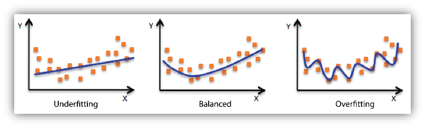

## Machine learning excels in situations where:
- Solutions require extensive fine-tuning or complex rules.
- Traditional methods fail to yield effective solutions.
- The environment is highly variable.
- Insights from complex problems and large datasets are needed.

# Types of machine learning systems:
- Supervision during training: Includes supervised, unsupervised, semi-supervised, self-supervised, and reinforcement learning.
- Learning method: Online (incremental learning) versus batch (offline learning).
- Learning approach: Instance-based (compares new data to known data) versus model-based (builds a predictive model from the training data).

# Supervised learning
In supervised learning, the training data is labeled. The model learns by mapping inputs to the desired outputs. Common tasks include:
- Classification: Assigning labels to categories.
- Regression: Predicting a numeric value.

# Unsupervised learning
The training data is not labeled. The model identifies patterns without explicit instructions. Techniques include:
- Clustering: Grouping data based on similarity.
- Dimensionality Reduction: Simplifying data while retaining important information.
- Anomaly Detection: Identifying outliers.

# Semi-supervised learning
Semi-supervised learning is a machine learning approach where the training data consists of both labeled and unlabeled examples. Typically, a small portion of the data is labeled, and a larger portion is unlabeled. The model leverages the labeled data to learn initial patterns and then uses the unlabeled data to further refine these patterns and enhance the learning process. This method is particularly useful when acquiring labeled data is expensive or time-consuming.

Example:

Recognizing people in photos: Suppose you have a dataset of thousands of photos, but only a small number of them are labeled with the names of the people in the photos. Semi-supervised learning can be used to build a model that initially learns from the labeled photos. Once it has a basic understanding, it uses the patterns and structures found in the unlabeled photos to improve its ability to recognize people.

# Self-supervised learning
Self-supervised learning is a form of unsupervised learning where the model learns to predict part of its input from other parts of the input. The training data is entirely unlabeled, and the model generates its own labels from the data itself. This approach helps the model to find patterns and structures in the data autonomously.

Example:

Recognizing objects in images: In a dataset of unlabeled images, a self-supervised learning model might be trained to predict the missing parts of an image or the next frame in a sequence of images. By learning to predict these elements, the model understands the context and patterns within the images.

# Reinforcement learning
Reinforcement learning involves an agent that interacts with the environment, performing actions and receiving rewards or penalties. The goal is to learn a strategy (policy) that maximizes rewards over time. It's often used in robotics for tasks like learning to walk.

# Batch Versus Online Learning
- Batch Learning: The model is trained on the entire dataset at once (offline learning).
- Online Learning: The model is trained incrementally with one example or a small batch at a time. The learning rate determines how quickly the model adapts to new data.

# Instance-Based Versus Model-Based Learning
Instance-based learning: The system memorizes examples and uses a similarity measure to generalize to new cases.

Model-based learning:  The system creates a mathematical model to predict outcomes based on input data.

## The most common problems are either bad model or bad data
# Bad data:
- insufficient quantity
- nonrepresentative training data - data need to be representative for the cases you want to generalize to
- poor quality data - full of errors, outliners and noise
- Irrelevant features - enough relevant features and not too many

# Bad model:
- Overfitting the training data - model does well on training data but badly on new ones
Constraining a model to make it simpler and reduce the risk of overfitting is called **regularization**
The amount of regularization to apply during learning can be controlled by a **hyperparameter**. It is set prior to training and remains the same. 
- Underfitting the training data - model performs poorly on training data
Main options to fix this are: select model with more parameters, feed better features, reduce the constraints on the model

## Testing and validating
Data is typically split into training and test sets (often 80/20). The performance on the test set, called the generalization error or out-of-sample error, provides an estimate of how well the model will perform on new data.
By understanding these foundational concepts, you can better navigate the field of machine learning and apply the appropriate techniques to your specific problems.

# Hyperparameter tuning and Model selection
Holdout validation involves setting aside a portion of the training data as a validation set to evaluate multiple models and select the best one. 
After choosing the best model, it is trained on the full training set, including the validation set, and then evaluated on a test set to estimate generalization error. 
If the validation set is too small, model evaluations may be imprecise; if too large, the remaining training set is reduced, potentially affecting model performance. 
Repeated cross-validation, which averages performance across multiple small validation sets, provides a more accurate evaluation but increases training time. 
This method balances the need for precise evaluations with the practical constraints of training time.

# Data Dismatch
When training a model, the validation and test sets must represent the data expected in production. 
For example, if building a flower identification app, web images may not match app-taken photos. 
Therefore, validation and test sets should only include representative pictures. 
If the model performs poorly on the validation set after training on web images, the issue might be due to overfitting or data mismatch. 
To address this, a "train-dev" by Andrew Ng set can be used to diagnose overfitting. 
If overfitting is not the issue, preprocessing web images to resemble app photos might help. Finally, evaluate the model on the test set to estimate production performance.

## Summary
- Machine learning is about making machines get better at some task by
learning from data, instead of having to explicitly code rules.
- There are many different types of ML systems: supervised or not, batch
or online, instance-based or model-based.
- In an ML project you gather data in a training set, and you feed the
training set to a learning algorithm. If the algorithm is model-based, it
tunes some parameters to fit the model to the training set (i.e., to make
good predictions on the training set itself), and then hopefully it will be
able to make good predictions on new cases as well. If the algorithm is
instance-based, it just learns the examples by heart and generalizes to
new instances by using a similarity measure to compare them to the
learned instances.
- The system will not perform well if your training set is too small, or if
the data is not representative, is noisy, or is polluted with irrelevant
features (garbage in, garbage out). Lastly, your model needs to be
neither too simple (in which case it will underfit) nor too complex (in
which case it will overfit).

TIP
It is often a good idea to try to reduce the number of dimensions in your training data
using a dimensionality reduction algorithm before you feed it to another machine learning
algorithm (such as a supervised learning algorithm). It will run much faster, the data will
take up less disk and memory space, and in some cases it may also perform better.

NOTE
Transferring knowledge from one task to another is called transfer learning, and it’s one
of the most important techniques in machine learning today, especially when using deep
neural networks

TIP
Overfitting happens when the model is too complex relative to the amount and noisiness
of the training data. Here are possible solutions:
Simplify the model by selecting one with fewer parameters (e.g., a linear model
rather than a high-degree polynomial model), by reducing the number of attributes
in the training data, or by constraining the model.
Gather more training data.
Reduce the noise in the training data (e.g., fix data errors and remove outliers).