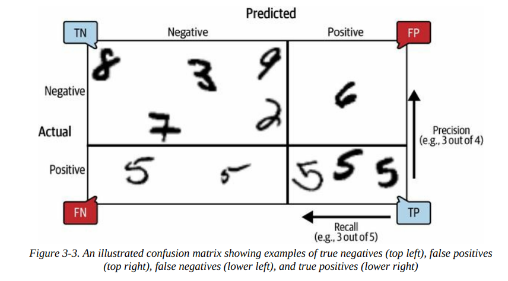
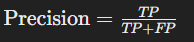
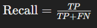
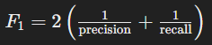

# Classification

# Mnist
- importing the dataset
- splitting the dataset into training and testing sets

# Training a Binary Classifier
Binary classifier is a ml model designed to determine which one of two classes a given input belongs
- starting by only identifying one digit
- using stochastic gradient descent (*Summary*)

# Performance Measures
## Measuring Accuracy Using Cross-Validation
Cross-Validation Accuracy: High accuracy values from cross_val_score suggest that the SGDClassifier performs well on the training data.
Dummy Classifier: Comparing with a dummy classifier helps confirm that the model’s high accuracy is not just due to class imbalance but reflects its actual predictive power.

For example, in your case, since only about 10% of the images are of the digit '5', a classifier that always predicts "not a 5" will still achieve a high accuracy of around 90%. This high accuracy can be deceptive because it doesn't reflect how well the model is performing on the minority class

Stratified k-fold (*Summary*) do what cross-validation does, where each fold maintains class distribution. It trains a cloned classifier on training data and evaluates it on test data, printing the accuracy for each fold. This approach allows for custom cross-validation control and is especially useful when fine-tuning the process.

## Confusion Matrices

To evaluate a classifier, the confusion matrix provides insights into how often the model misclassifies instances of one class as another. Here's how you can use it effectively:
Confusion Matrix:
- It counts the number of times instances of each class are classified as each possible class.
- For instance, if you're interested in how often images of 8s are misclassified as 0s, you'd check the value in row #8, column #0 of the matrix.

Using cross_val_predict():
- Instead of using the test set directly for predictions (which you should reserve for final evaluation), use cross_val_predict() to get predictions through k-fold cross-validation.
- This function returns predictions for each instance in the training set as if it were out-of-sample data, providing a clearer picture of model performance.

Computing the Confusion Matrix:
- Once you have the predictions, use the confusion_matrix() function.
- Pass the true labels (y_train_5) and the predicted labels (y_train_pred) to this function to generate the confusion matrix.

Precision and Recall are key metrics used to evaluate the performance of a classifier, especially in scenarios with imbalanced classes.

Precision:

​
Where:

TP: True Positives - the number of correctly identified positive instances.
FP: False Positives - the number of incorrectly identified positive instances.
Explanation: Precision measures how many of the predicted positive instances are actually positive. A classifier with perfect precision predicts all positive cases correctly but might only make a few positive predictions overall.

Example: A classifier that always predicts negative except for one instance (which is correctly predicted as positive) would have 100% precision (since it made one correct positive prediction out of one attempt). However, this is not practical for real-world applications where you need to detect multiple positive instances.

Recall (Sensitivity or True Positive Rate)
Recall: 

​
Where:

TP: True Positives - the number of correctly identified positive instances.
FN: False Negatives - the number of positive instances that were incorrectly identified as negative.
Explanation: Recall measures how many of the actual positive instances were correctly detected by the classifier. It is important when the goal is to identify as many positive cases as possible, even if it means some false positives.

Example: If a classifier identifies 80 out of 100 actual positives correctly but misses 20, its recall would be 80%.

## Precission and Recall

To better evaluate classifiers, precision and recall can be combined into a single metric called the F1 score, which is the harmonic mean of precision and recall. This means the F1 score is high only if both precision and recall are high

The F score favors classifiers with similar precision and recall, which isn't always ideal. Sometimes precision is more important, other times it's recall. For instance, a classifier detecting kid-safe videos should prioritize high precision, even if it means low recall, to ensure only safe videos are kept. Conversely, a classifier identifying shoplifters can have low precision if it maintains high recall, ensuring most shoplifters are caught despite some false alerts. Increasing precision reduces recall and vice versa, known as the precision/recall trade-off.

## The Precision/Recall Trade-off

# Summary
## [stochastic gradient descent](https://www.geeksforgeeks.org/ml-stochastic-gradient-descent-sgd/)

Stochastic Gradient Descent (SGD) is an optimization algorithm used in training machine learning models, especially in deep learning and linear regression. It is a variant of the Gradient Descent algorithm and is particularly useful for large datasets and online learning scenarios.

Gradient Descent:
Gradient Descent is an optimization technique used to minimize a loss function by iteratively moving towards the minimum value.
It involves computing the gradient (partial derivatives) of the loss function with respect to the model parameters and updating the parameters in the opposite direction of the gradient.

Stochastic Gradient Descent:
Unlike traditional Gradient Descent, which uses the entire dataset to compute the gradient at each step, SGD uses only one sample (or a small batch of samples) at each iteration.
This makes SGD faster and more suitable for large datasets because it can start making progress right away and does not require loading the entire dataset into memory.

## [StratifiedKFold](https://www.geeksforgeeks.org/stratified-k-fold-cross-validation/)
StratifiedKFold is an enhancement to the standard k-fold cross-validation method. It ensures that each fold of the dataset used for training and testing preserves the percentage of samples for each class label, maintaining the class distribution across all folds. This is particularly useful for imbalanced datasets, where some classes are much more frequent than others.

## [Decision Function](https://www.geeksforgeeks.org/ml-decision-function/)
Decision function is a method present in classifier{ SVC, Logistic Regression } class of sklearn machine learning framework. This method basically returns a Numpy array, In which each element represents whether a predicted sample for x_test by the classifier lies to the right or left side of the Hyperplane and also how far from the HyperPlane. It also tells us that how confidently each value predicted for x_test by the classifier is Positive ( large-magnitude Positive value ) or Negative ( large-magnitude Negative value)

# 192